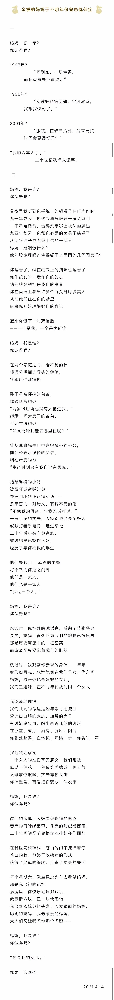

# 我出生后，妈妈被抑郁症折磨了六年

那时候我尚未记事，而妈妈因病丢失了记忆。去年冬天我向妈妈问起这件事，母女俩东拼西凑地回忆。

我将这段往事写成了一首诗，我想这是我们作为女性共通的经验。二十年过去了，我们仍然生活在相同的性别环境中，受到父权主义的伤害。分享给姐妹们，希望更多的女性觉醒。

[https://www.douban.com/group/topic/250062256/](https://www.douban.com/group/topic/250062256/)
